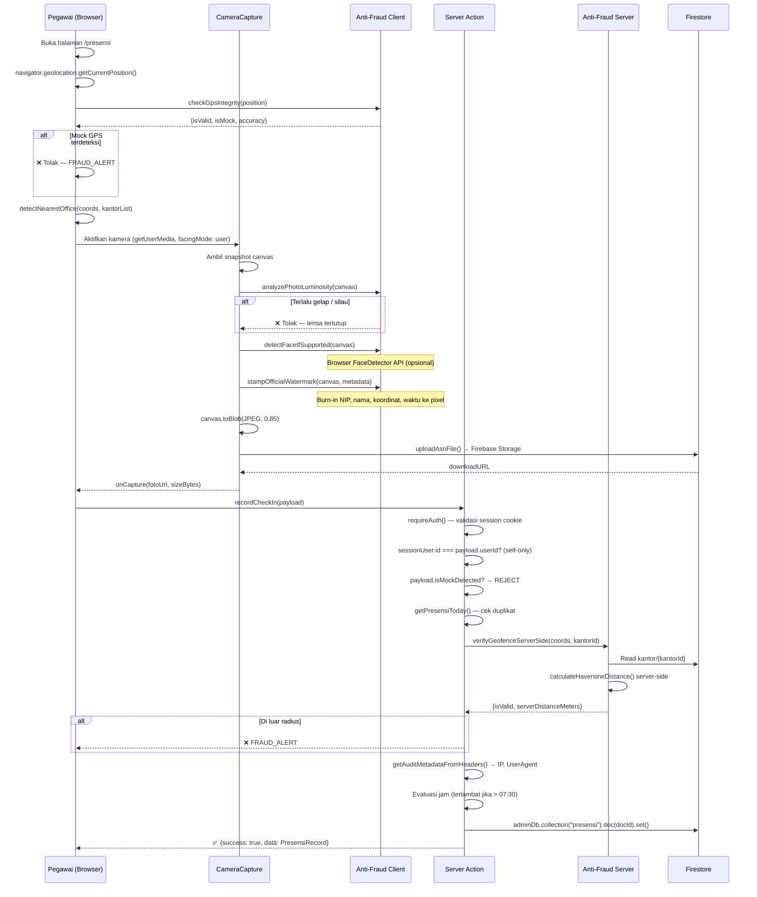
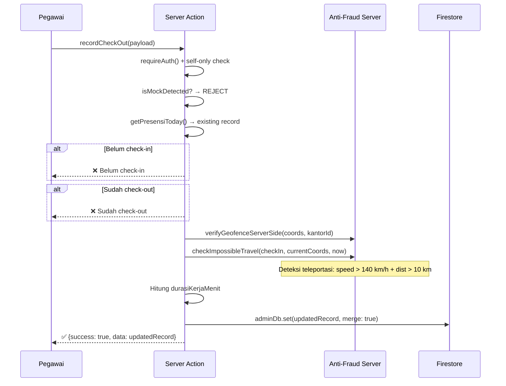
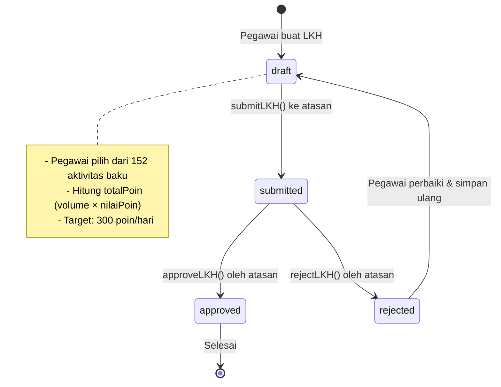
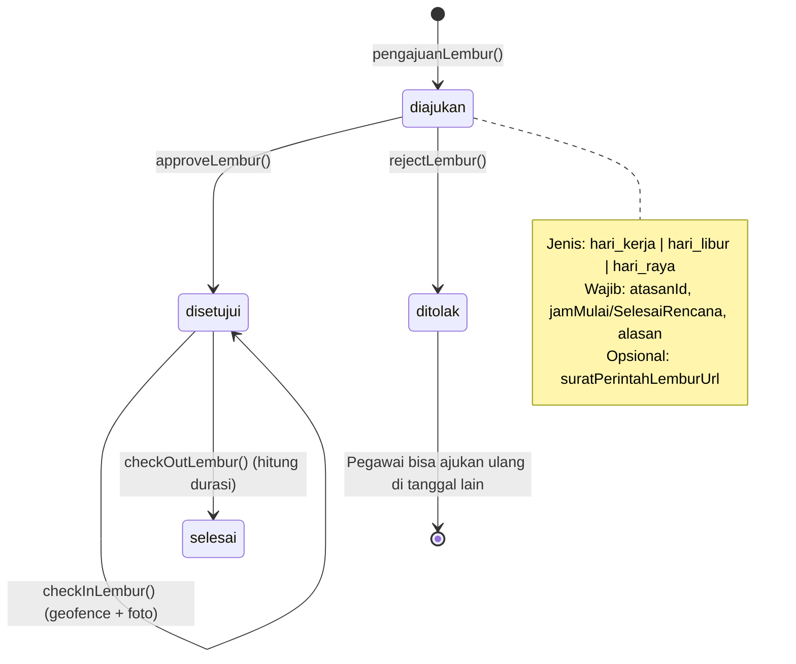
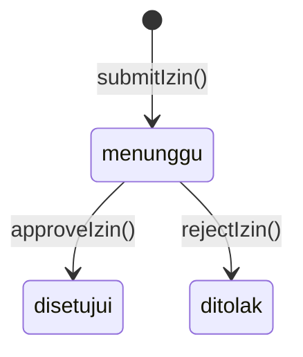
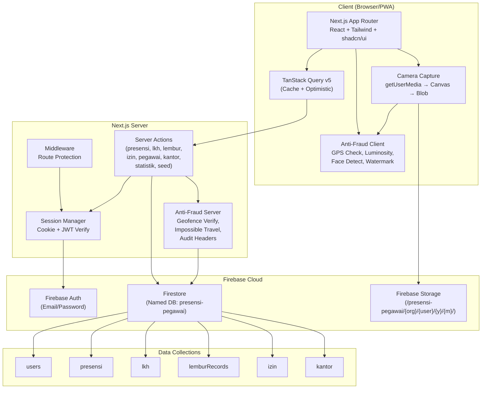

<!-- BEGIN:nextjs-agent-rules -->

# This is NOT the Next.js you know

This version has breaking changes — APIs, conventions, and file structure may all differ from your training data. Read the relevant guide in `node_modules/next/dist/docs/` (resolved from this file's directory; in monorepos the `next` package may not be visible from the repo root) before writing any code. Heed deprecation notices.

This block is written and re-added by `next dev` — verify at `node_modules/next/dist/server/lib/generate-agent-files.js`. Removing it from a diff only re-creates the uncommitted change; committing it with your work keeps the tree clean.

<!-- END:nextjs-agent-rules -->

---

# 📋 AUDIT SISTEM LENGKAP — Presensi & LKH Pegawai

> **Tanggal Audit**: 24 September 2026  
> **Auditor**: Antigravity IDE (Deep Code Audit)  
> **Cakupan**: Seluruh modul (Check-In, Camera, LKH, Lembur, Izin, Statistik, Pegawai, Kantor, Anti-Fraud, Auth, Firestore Rules, Storage)  
> **Jumlah File Diaudit**: 30+ file inti (.ts, .tsx, rules, config)

---

## Ringkasan Eksekutif

1. ✅ **Arsitektur solid** — Next.js App Router + Firebase + TanStack Query + Server Actions tersusun rapi dan konsisten
2. ✅ **Anti-Fraud berlapis** — Geofence server-side (zero-trust), mock GPS detection, impossible travel, watermark forensik, luminosity check, face detection
3. ⚠️ **14 temuan risiko** ditemukan (5 Critical, 4 High, 5 Medium) — detail di bawah
4. ⚠️ **Isolasi multi-tenant belum ketat** — `orgId` belum difilter secara konsisten di semua query Firestore
5. 🎯 **Blueprint 12 fitur** direkomendasikan untuk roadmap White-Label SaaS

---

## 1. Arsitektur Sistem

### 1.1 Technology Stack

| Layer | Teknologi | Status |
|-------|-----------|--------|
| Framework | Next.js 14+ (App Router) | ✅ Sesuai |
| Auth | Firebase Auth v10 (Email/Password) | ✅ Sesuai |
| Database | Firestore v10 (Named DB: `presensi-pegawai`) | ✅ Sesuai |
| Storage | Firebase Storage v10 | ✅ Sesuai |
| Server State | TanStack Query v5 | ✅ Sesuai |
| Styling | Tailwind CSS v4 + shadcn/ui (Semantic CSS) | ✅ Sesuai |
| Package Manager | pnpm | ✅ Sesuai |
| Language | TypeScript (strict) | ✅ Sesuai |

### 1.2 Peta Modul Aplikasi

```
src/
├── actions/              # Server Actions (Write ke Firestore via Admin SDK)
│   ├── presensi.ts       # recordCheckIn, recordCheckOut, getPresensiToday, getPresensiHistory
│   ├── lkh.ts            # saveLKH, submitLKH, approveLKH, rejectLKH, getPendingLKHList
│   ├── lembur.ts         # pengajuanLembur, approve/reject, checkIn/OutLembur, getPendingLemburList
│   ├── izin.ts           # submitIzin, approveIzin, rejectIzin, getIzinList
│   ├── pegawai.ts        # createPegawai, updatePegawai, deletePegawai, getPegawaiList
│   ├── kantor.ts         # getKantorList, saveKantor, deleteKantor
│   ├── statistik.ts      # calculateRekapStatistik, getRekapStatistikAction
│   └── seed.ts           # seedDatabaseAction (reset & init demo data)
├── hooks/                # Custom Hooks (Read via TanStack Query)
│   ├── usePresensi.ts    # usePresensiHarian, useRiwayatPresensi, useCheckIn/OutMutation
│   ├── useLKH.ts         # useLKHHarian, usePendingLKHList, useSave/Submit/Approve/RejectLKH
│   ├── useLembur.ts      # useLemburHarian, useLemburHistory, usePendingLemburList, mutations
│   ├── useIzin.ts        # useIzinList, useSubmitIzin
│   ├── useKantor.ts      # useKantorList, useSaveKantor, useDeleteKantor
│   ├── usePegawai.ts     # usePegawaiList, useCreatePegawai, useUpdatePegawai
│   └── useStatistik.ts   # useRekapStatistik
├── lib/
│   ├── firebase/
│   │   ├── config.ts     # Client SDK init (named DB)
│   │   ├── admin.ts      # Admin SDK (Lazy Proxy pattern, credential validation)
│   │   ├── session.ts    # Cookie-based session (requireAuth, getCurrentUserFromSession)
│   │   ├── auth-helpers.ts  # loginWithNipOrEmail, getUserProfile, normalizeNipToEmail
│   │   └── storage-helpers.ts  # uploadAsnFile, generateAsnStoragePath
│   ├── anti-fraud/
│   │   ├── server.ts     # verifyGeofenceServerSide, checkImpossibleTravel, getAuditMetadata
│   │   └── client.ts     # stampOfficialWatermark, analyzePhotoLuminosity, detectFace, checkGpsIntegrity
│   ├── auth-context.tsx  # React Context Provider (AuthProvider, useAuth)
│   ├── constants.ts      # SESSION_COOKIE_NAME, SESSION_MAX_AGE_SECONDS (8 jam)
│   └── utils.ts          # cn(), formatRupiah(), formatBytes(), calculateStorageQuota()
├── components/
│   ├── presensi/CameraCapture.tsx  # Selfie capture + watermark + upload
│   ├── dashboard/        # Dashboard widgets
│   ├── logbook/          # LKH form components
│   ├── maps/             # Peta geofence
│   ├── providers/        # QueryProvider, ThemeProvider
│   └── ui/               # shadcn/ui primitives
├── data/
│   ├── masterKantor.ts   # Haversine distance, detectNearestOffice
│   ├── masterAktivitas.ts  # 152 aktivitas baku + kategori + poin
│   └── seedData.ts       # SEED_KANTOR, SEED_USERS, dev stores
├── types/index.ts        # Semua TypeScript interfaces
├── middleware.ts          # Route protection (cookie check)
└── app/
    ├── (auth)/login/      # Halaman login
    └── (dashboard)/       # 10 route protected
        ├── presensi/      # Check-in/out + kamera + geofence
        ├── laporan/       # LKH harian (kegiatan baku)
        ├── lembur/        # Pengajuan & presensi lembur
        ├── approval/      # Approval atasan (LKH + Lembur tab)
        ├── izin/          # Cuti & izin
        ├── kalender/      # Kalender kerja
        ├── statistik/     # Rekap & visualisasi
        ├── pegawai/       # Manajemen pegawai (Admin only)
        ├── pengaturan/    # Titik kantor & geofence (Admin only)
        └── profil/        # Profil pribadi
```

### 1.3 Koleksi Firestore

| Koleksi | Document ID Pattern | Kunci Isolasi |
|---------|-------------------|---------------|
| `users/{userId}` | Firebase Auth UID | `orgId`, `kantorId` |
| `presensi/{userId}_{YYYY-MM-DD}` | Compound key | `orgId`, `userId` |
| `lkh/{userId}_{YYYY-MM-DD}` | Compound key | `orgId`, `userId`, `atasanId` |
| `lemburRecords/{userId}_{YYYY-MM-DD}` | Compound key | `orgId`, `userId`, `atasanId` |
| `izin/{izin-timestamp}` | Random timestamp | `userId` |
| `kantor/{kantorId}` | Custom ID | `orgId` |

---

## 2. Alur Bisnis Lengkap

### 2.1 Alur Check-In Presensi



### 2.2 Alur Check-Out Presensi



### 2.3 Alur LKH (Laporan Kegiatan Harian)



**Alur detail:**
1. Pegawai membuka `/laporan`, memilih tanggal
2. Menambahkan kegiatan dari master 152 aktivitas (kategorisasi: Persuratan, Manajerial, Pelayanan, dll)
3. Sistem otomatis menghitung `totalPoinHarian` (volume × nilaiPoin per aktivitas)
4. Pegawai `saveLKH()` → status `draft`
5. Pegawai `submitLKH()` → status `submitted`, kirim ke atasan via `atasanId`
6. Atasan buka `/approval` → tab LKH → lihat pending list (difilter per `atasanId`)
7. Atasan `approveLKH()` → status `approved` | `rejectLKH()` → status `rejected`

### 2.4 Alur Lembur



**Alur detail:**
1. Pegawai buka `/lembur`, isi form pengajuan (jenis, jam, alasan)
2. `pengajuanLembur()` → status `diajukan`, kirim ke atasan
3. Atasan buka `/approval` → tab Lembur → approve / reject
4. Setelah `disetujui`, pegawai bisa:
   - `checkInLembur()` — wajib geofence + selfie (sama ketatnya dengan presensi reguler)
   - `checkOutLembur()` — hitung `durasiLemburMenit`, ubah status ke `selesai`
5. Validasi: tidak boleh check-in jika status bukan `disetujui`

### 2.5 Alur Izin & Cuti



**Jenis izin:** Cuti Tahunan, Izin Alasan Penting, Sakit, Dinas Luar.
Mendukung upload dokumen pendukung (surat sakit, surat tugas).

### 2.6 Alur Manajemen Pegawai

- **Create**: Admin `createPegawaiAction()` → Dual provisioning (Firebase Auth + Firestore `users/{uid}`)
- **Update**: Admin `updatePegawaiAction()` → Auto-sync `atasanNama` saat `atasanId` diubah
- **Delete**: Admin `deletePegawaiAction()` → Delete Auth + Delete Firestore doc
- **Filter**: Daftar pegawai bisa difilter per `kantorId`, `role`, dan search text

---

## 3. Mekanisme Keamanan & Anti-Fraud

### 3.1 Lapisan Keamanan Berlapis

| # | Lapisan | Lokasi | Mekanisme |
|---|---------|--------|-----------|
| 1 | **Middleware Route Guard** | `middleware.ts` | Cookie check → redirect ke `/login` |
| 2 | **Server Action Auth** | `requireAuth()` | JWT token verification via Admin SDK |
| 3 | **Self-Only Enforcement** | Setiap action | `sessionUser.id !== payload.userId` → FORBIDDEN |
| 4 | **Role-Based Access** | `requireAuth(["admin","atasan"])` | Filter per role |
| 5 | **Atasan Scope Filter** | `getPendingLKHList`, dll | `item.atasanId === sessionUser.id` |
| 6 | **Client GPS Integrity** | `checkGpsIntegrity()` | Deteksi flag `isMock`/`mocked` + accuracy check |
| 7 | **Server Geofence** | `verifyGeofenceServerSide()` | Haversine recalculation — zero-trust |
| 8 | **Impossible Travel** | `checkImpossibleTravel()` | Speed > 140 km/h + distance > 10 km |
| 9 | **Photo Luminosity** | `analyzePhotoLuminosity()` | Tolak foto gelap (< 20) atau putih (> 248) |
| 10 | **Face Detection** | `detectFaceIfSupported()` | Browser FaceDetector API (Chrome) |
| 11 | **Forensic Watermark** | `stampOfficialWatermark()` | Burn-in NIP, nama, koordinat, waktu ke pixel foto |
| 12 | **Audit Trail** | IP + User Agent | Dicatat di setiap check-in/out |
| 13 | **Firestore Rules** | `firestore.rules` | Document-level ACL |
| 14 | **Storage Rules** | `storage.rules` | Path-based ACL + size/type restriction |

### 3.2 Firestore Security Rules — Audit

| Koleksi | Read | Create | Update | Delete | Catatan |
|---------|------|--------|--------|--------|---------|
| `users` | ✅ Authenticated | ✅ Admin/Owner | ✅ Admin / Owner (field-restricted) | ✅ Admin only | Owner tidak bisa ubah role/NIP/kantorId |
| `presensi` | ✅ Owner/Atasan | ✅ Self/Admin | ✅ Self/Admin | ✅ Admin only | ✅ Aman |
| `lkh` | ✅ Owner/Atasan | ✅ Self/Admin | ✅ Self/Atasan/Admin | ✅ Owner(draft)/Admin | ⚠️ Lihat temuan #5 |
| `izin` | ✅ Owner/Atasan | ✅ Self/Admin | ✅ Atasan only | ✅ Owner(pending)/Admin | ⚠️ Status field: `pending` vs `menunggu` |
| `kantor` | ✅ Authenticated | ✅ Admin | ✅ Admin | ✅ Admin | ✅ Aman |
| `lemburRecords` | ✅ Owner/Atasan | ✅ Self/Admin | ✅ Self(disetujui)/Atasan/Admin | ✅ Owner(draft)/Admin | ✅ Aman |

### 3.3 Storage Rules — Audit

- ✅ Path hierarki: `/presensi-pegawai/{orgId}/{userId}/{year}/{month}/`
- ✅ Max file size: 15 MB
- ✅ Content-type restriction: image/*, PDF, Word, Excel
- ✅ Owner-only write, Owner+Admin delete
- ⚠️ `isAtasanOrAdmin()` fallback ke email pattern `@surakarta.go.id` — tidak universal untuk white-label

---

## 4. Temuan Audit — Bug & Risiko

### 🔴 CRITICAL (Harus Diperbaiki)

#### C-1: Multi-Tenant Isolation TIDAK Ketat

**Lokasi**: [`presensi.ts`](file:///d:/Project/GAWE/PresensiASN/src/actions/presensi.ts), [`lkh.ts`](file:///d:/Project/GAWE/PresensiASN/src/actions/lkh.ts), [`lembur.ts`](file:///d:/Project/GAWE/PresensiASN/src/actions/lembur.ts)

**Masalah**: Query `getPresensiHistory()`, `getPendingLKHList()`, `getPendingLemburList()` tidak selalu menerapkan filter `orgId` secara wajib. Jika admin/atasan dari Organisasi A mengakses endpoint, mereka bisa melihat data dari Organisasi B.

**Dampak**: Data pegawai lintas organisasi bisa bocor.

**Rekomendasi**:
```typescript
// WAJIB: Filter orgId dari session user
const sessionUser = await requireAuth(["atasan", "admin"]);
query = query.where("orgId", "==", sessionUser.orgId);
```

---

#### C-2: Collection Name Inkonsisten antara Server Action dan Firestore Rules

**Lokasi**: 
- [`presensi.ts:36`](file:///d:/Project/GAWE/PresensiASN/src/actions/presensi.ts#L36) → collection `"presensi"`
- [`lkh.ts:37`](file:///d:/Project/GAWE/PresensiASN/src/actions/lkh.ts#L37) → collection `"lkh"`
- [`firestore.rules:54`](file:///d:/Project/GAWE/PresensiASN/firestore.rules#L54) → match `/presensi/{presensiId}`
- [`firestore.rules:78`](file:///d:/Project/GAWE/PresensiASN/firestore.rules#L78) → match `/lkh/{lkhId}`

**Status**: ✅ Konsisten — nama collection di rules cocok dengan server action.

**TAPI**: Skill doc ([`SKILL.md:107`](file:///d:/Project/GAWE/PresensiASN/.agents/skills/presensi-asn-stack/SKILL.md#L107)) menyebut collection `presensiRecords` dan `lkhRecords` yang **berbeda** dari kode aktual (`presensi` dan `lkh`).

**Dampak**: Kebingungan developer baru yang membaca SKILL.md — bisa mengarahkan ke collection yang salah.

---

#### C-3: Izin Firestore Rule Mismatch — Status `pending` vs `menunggu`

**Lokasi**: 
- [`firestore.rules:126`](file:///d:/Project/GAWE/PresensiASN/firestore.rules#L126) → `resource.data.status == 'pending'`
- [`izin.ts:68`](file:///d:/Project/GAWE/PresensiASN/src/actions/izin.ts#L68) → status diset sebagai `"menunggu"`

**Masalah**: Firestore rules menggunakan `'pending'` untuk pembatalan izin oleh pemilik, tapi kode server action menyimpan status `"menunggu"`. Ini berarti **pegawai tidak bisa menghapus/membatalkan izin mereka sendiri** karena condition tidak pernah match.

**Dampak**: Fitur pembatalan izin oleh pegawai rusak (dead code).

**Fix**: Ubah `firestore.rules:126` dari `'pending'` ke `'menunggu'`.

---

#### C-4: `getIzinList()` Tidak Filter Per `atasanId` untuk Role Atasan

**Lokasi**: [`izin.ts:15-46`](file:///d:/Project/GAWE/PresensiASN/src/actions/izin.ts#L15-L46)

**Masalah**: `getIzinList()` saat dipanggil tanpa `userId` (mode atasan/admin) mengembalikan **semua izin tanpa filter `atasanId`**. Berbeda dengan `getPendingLKHList()` dan `getPendingLemburList()` yang sudah benar memfilter per `atasanId`.

**Dampak**: Atasan A bisa melihat izin pegawai yang bukan bawahannya.

**Rekomendasi**: Tambahkan filter `atasanId` yang sama seperti di LKH dan Lembur.

---

#### C-5: `getPresensiToday()` Tidak Memiliki `requireAuth()`

**Lokasi**: [`presensi.ts:28-62`](file:///d:/Project/GAWE/PresensiASN/src/actions/presensi.ts#L28-L62)

**Masalah**: Fungsi `getPresensiToday()` adalah server action yang **tidak memanggil `requireAuth()`** di baris pertama. Ini melanggar aturan keamanan yang ditetapkan di SKILL.md dan berbeda dari semua action lain.

**Dampak**: Secara teori, siapa pun yang bisa mengirim request ke server action ini bisa membaca data presensi tanpa terautentikasi.

**Catatan**: `getPresensiHistory()` juga tidak memanggil `requireAuth()`.

---

### 🟠 HIGH (Sebaiknya Diperbaiki)

#### H-1: `izin.ts` Tidak Menyimpan `atasanId` pada Record Izin

**Lokasi**: [`izin.ts:52-81`](file:///d:/Project/GAWE/PresensiASN/src/actions/izin.ts#L52-L81), [`types/index.ts:174-188`](file:///d:/Project/GAWE/PresensiASN/src/types/index.ts#L174-L188)

**Masalah**: Type `PengajuanIzinItem` tidak memiliki field `atasanId`. Ini membuat izin tidak bisa difilter per atasan langsung. Fungsi `getIzinList()` juga tidak bisa menerapkan pola `item.atasanId === sessionUser.id` seperti di modul LKH dan Lembur.

**Dampak**: Atasan melihat SEMUA izin pegawai, bukan hanya bawahan langsung.

---

#### H-2: Statistik Summary Menggunakan Hard-Coded Minimum Values

**Lokasi**: [`statistik.ts:335-345`](file:///d:/Project/GAWE/PresensiASN/src/actions/statistik.ts#L335-L345)

**Masalah**:
```typescript
rataRataKehadiranRate: Math.min(100, Math.max(88, avgKehadiran)),  // Min 88%!
disiplinWaktuRate: Math.min(100, Math.max(85, disiplinRate || 92)), // Min 85%!
totalHadir: sumHadir || 84,  // Default 84 jika kosong!
```

**Dampak**: Data statistik tidak akurat — selalu menampilkan angka "bagus" meskipun kenyataannya buruk. Ini menipu manajemen.

---

#### H-3: Dev In-Memory Store untuk Lembur TIDAK Persist

**Lokasi**: [`lembur.ts:18`](file:///d:/Project/GAWE/PresensiASN/src/actions/lembur.ts#L18)

**Masalah**: `devLemburStore` dideklarasikan sebagai `const devLemburStore = new Map()` langsung di modul, sementara presensi dan LKH menggunakan `getDevPresensiStore()` / `getDevLKHStore()` dari `seedData.ts` yang bisa di-seed ulang.

**Dampak**: Data lembur dev hilang setiap kali server di-restart. Inkonsistensi pola dev store.

---

#### H-4: Storage Rules Hardcode Email Pattern `@surakarta.go.id`

**Lokasi**: [`storage.rules:16`](file:///d:/Project/GAWE/PresensiASN/storage.rules#L16)

**Masalah**: `isAtasanOrAdmin()` menggunakan regex `.*@surakarta\\.go\\.id` sebagai fallback check. Ini tidak kompatibel dengan white-label untuk organisasi non-pemerintah (swasta, BLUD).

**Dampak**: Atasan dari organisasi swasta mungkin tidak bisa membaca file bawahan.

---

### 🟡 MEDIUM (Perbaikan Bertahap)

#### M-1: Duplikasi Check-In Hanya 1 Slot Per Hari

**Lokasi**: [`presensi.ts:96-101`](file:///d:/Project/GAWE/PresensiASN/src/actions/presensi.ts#L96-L101)

**Masalah**: Document ID pattern `{userId}_{YYYY-MM-DD}` hanya mengizinkan 1 record presensi per hari. Tidak ada mekanisme untuk presensi shift (pagi/siang/malam).

**Dampak**: Tidak mendukung skenario BLUD/rumah sakit dengan sistem shift.

---

#### M-2: Jam Masuk/Pulang Tidak Dibaca dari Data Kantor

**Lokasi**: [`presensi.ts:19`](file:///d:/Project/GAWE/PresensiASN/src/actions/presensi.ts#L19)

**Masalah**: `JAM_MASUK_MAKSIMAL` diambil dari env variable global, bukan dari `KantorUnit.jamMasukMaksimal`. Padahal model `KantorUnit` sudah memiliki field `jamMasukMaksimal` dan `jamPulangMinimal` per kantor.

**Dampak**: Semua kantor terpaksa menggunakan jam masuk yang sama (07:30), padahal BLUD/RS mungkin punya jam berbeda.

---

#### M-3: `kantor.ts` Tidak Memiliki Dev Store Fallback yang Konsisten

**Lokasi**: [`kantor.ts:12-64`](file:///d:/Project/GAWE/PresensiASN/src/actions/kantor.ts#L12-L64)

**Masalah**: `getKantorList()` tidak memanggil `requireAuth()` (tapi `saveKantor()` dan `deleteKantor()` memanggil). Selain itu, `saveKantor()` dan `deleteKantor()` tidak memiliki dev store fallback — langsung crash jika Firebase Admin tidak configured.

---

#### M-4: Tidak Ada Validasi Jam Pulang Minimal pada Check-Out

**Lokasi**: [`presensi.ts:172-282`](file:///d:/Project/GAWE/PresensiASN/src/actions/presensi.ts#L172-L282)

**Masalah**: `recordCheckOut()` tidak memvalidasi apakah waktu check-out sudah melewati `jamPulangMinimal` kantor. Pegawai bisa check-out 1 menit setelah check-in.

---

#### M-5: Session Cookie Non-httpOnly di Client-Side

**Lokasi**: [`auth-context.tsx:36`](file:///d:/Project/GAWE/PresensiASN/src/lib/auth-context.tsx#L36)

**Masalah**: `persistTokenToCookie()` menyimpan token via `document.cookie` (accessible by JS), sementara `setSessionCookie()` di `session.ts` menyimpan via httpOnly cookie. Terjadi duplikasi — ada 2 cookie mechanism berjalan paralel.

**Dampak**: Token bisa dicuri via XSS pada cookie client-side.

---

## 5. Skor Kematangan Sistem

| Aspek | Skor | Keterangan |
|-------|------|------------|
| **Arsitektur** | 9/10 | Clean architecture, separation of concerns sangat baik |
| **Type Safety** | 9/10 | TypeScript strict, Zod validation (belum diterapkan di semua payload) |
| **Keamanan Auth** | 7/10 | Server-side solid, tapi ada gap requireAuth() missing di beberapa action |
| **Anti-Fraud** | 9/10 | Best-in-class untuk aplikasi presensi Indonesia |
| **Multi-Tenant Isolation** | 5/10 | orgId ada tapi tidak difilter secara wajib di semua query |
| **White-Label Readiness** | 4/10 | Terminologi sudah universal, tapi config masih hardcoded (email pattern, jam kerja, branding) |
| **Data Integrity** | 7/10 | Duplikasi check dicek, tapi statistik di-floor ke angka minimum |
| **UX / Offline** | 7/10 | TanStack Query caching ada, tapi belum ada offline queue |
| **Dokumentasi** | 7/10 | SKILL.md komprehensif, tapi ada inkonsistensi nama collection |
| **Testing** | 2/10 | Tidak ditemukan test suite (unit/integration/e2e) |

**Skor Total: 66/100** — *Sistem fungsional dan arsitekturnya kuat, namun membutuhkan hardening multi-tenant, perbaikan bug kritis, dan test coverage.*

---

## 6. Blueprint Pengembangan Lanjutan

### Phase 1 — Bug Fix & Hardening (Minggu 1-2)

| # | Item | Prioritas | Effort |
|---|------|-----------|--------|
| 1 | Fix C-1: Tambah filter `orgId` wajib dari session di semua query | 🔴 Critical | 2-3 jam |
| 2 | Fix C-3: Sinkronkan status izin `menunggu` di Firestore rules | 🔴 Critical | 15 menit |
| 3 | Fix C-4: Tambah filter `atasanId` di `getIzinList()` | 🔴 Critical | 30 menit |
| 4 | Fix C-5: Tambah `requireAuth()` di `getPresensiToday()` & `getPresensiHistory()` | 🔴 Critical | 15 menit |
| 5 | Fix H-1: Tambah field `atasanId`/`orgId` di `PengajuanIzinItem` | 🟠 High | 1 jam |
| 6 | Fix H-2: Hapus hard-coded minimum di statistik | 🟠 High | 30 menit |
| 7 | Fix H-4: Ubah Storage rules ke role-based tanpa email pattern | 🟠 High | 30 menit |
| 8 | Fix M-5: Konsolidasi ke satu cookie mechanism (httpOnly only) | 🟡 Medium | 2 jam |
| 9 | Sinkronkan SKILL.md dengan nama collection aktual | 📋 Doc | 30 menit |

### Phase 2 — White-Label & Multi-Tenant Isolation (Minggu 3-4) - ✅ Selesai

| # | Fitur | Deskripsi | Status |
|---|-------|-----------|--------|
| 1 | **Tenant Config Collection** | `organizations/{orgId}` dengan branding (logo, nama, warna, jam kerja default) | ✅ |
| 2 | **Dynamic Jam Kerja per Kantor** | Baca `KantorUnit.jamMasukMaksimal` di `recordCheckIn()` alih-alih env global | ✅ |
| 3 | **Admin Dashboard per Org** | Statistik, pegawai, kantor di-scope ke `orgId` pengguna login | ✅ |
| 4 | **Firestore Rules per Org** | Tambah validasi `resource.data.orgId == getUserData().orgId` di setiap rule | ✅ |
| 5 | **Custom Domain / Branding** | Konfigurasi logo, warna tema, nama instansi via admin panel per org | ✅ |

### Phase 3 — Fitur Baru (Bulan 2-3)

| # | Fitur | Deskripsi | Status |
|---|-------|-----------|--------|
| 1 | **Presensi Multi-Shift** | Dukung shift pagi/siang/malam dengan document ID `{userId}_{date}_{shift}` | ✅ |
| 2 | **Validasi Jam Pulang** | Tolak check-out sebelum `jamPulangMinimal` (dengan override admin) | ✅ |
| 3 | **Notifikasi Push** | FCM notification saat LKH/lembur approved/rejected | ✅ |
| 4 | **Export Rekap Resmi** | PDF/Excel format SPT kehadiran resmi instansi (jsPDF + xlsx) | ✅ |
| 5 | **Audit Log Terpisah** | Collection `auditLogs/{autoId}` mencatat setiap mutasi data | ✅ |
| 6 | **Zod Validation** | Tambahkan schema validation di semua server action payload | ✅ |
| 7 | **Testing Suite** | Vitest unit test + Playwright E2E | ✅ |

### Phase 4 — Enterprise (Bulan 4+)

| # | Fitur | Deskripsi |
|---|-------|-----------|
| 1 | **SSO / LDAP Integration** | Login via Active Directory untuk instansi besar |
| 2 | **Offline-First PWA** | Service Worker + IndexedDB queue untuk presensi tanpa internet |
| 3 | **Approval Chain Multi-Level** | Atasan → Kabid → Kadis untuk lembur/cuti bernilai tinggi |
| 4 | **API Integrasi SIMPEG** | REST API untuk sinkronisasi ke sistem kepegawaian nasional |
| 5 | **Dashboard Analytics AI** | Gemini-powered insight: prediksi absensi, anomali pola kehadiran |

---

## 7. Diagram Arsitektur Tingkat Tinggi



---

## 8. Matriks Peran & Akses

| Fitur | Pegawai | Atasan | Admin |
|-------|---------|--------|-------|
| Check-In / Check-Out | ✅ Self only | ✅ Self only | ✅ Self only |
| Lihat riwayat presensi sendiri | ✅ | ✅ | ✅ |
| LKH: Buat & Simpan draft | ✅ Self only | ✅ Self only | ✅ Self only |
| LKH: Submit ke atasan | ✅ | ✅ | ✅ |
| LKH: Approve / Reject | ❌ | ✅ Bawahan langsung | ✅ Semua |
| Pengajuan lembur | ✅ Self only | ✅ Self only | ✅ Self only |
| Approve / Reject lembur | ❌ | ✅ Bawahan langsung | ✅ Semua |
| Check-in/out lembur | ✅ (setelah disetujui) | ✅ | ✅ |
| Pengajuan izin/cuti | ✅ Self only | ✅ Self only | ✅ Self only |
| Approve / Reject izin | ❌ | ✅ | ✅ |
| Lihat statistik | ❌ | ✅ Tim sendiri | ✅ Semua |
| Kelola pegawai (CRUD) | ❌ | ❌ | ✅ |
| Kelola titik kantor | ❌ | ❌ | ✅ |
| Seed / Reset data demo | ❌ | ❌ | ✅ |

---

## 9. Firestore Index yang Dibutuhkan

| Collection | Fields | Order | Status |
|-----------|--------|-------|--------|
| `presensi` | `userId`, `tanggal` | `tanggal DESC` | Wajib |
| `presensi` | `orgId`, `tanggal` | `tanggal ASC` | Wajib (statistik) |
| `lkh` | `status`, `orgId` | — | Wajib (pending list) |
| `lkh` | `userId`, `tanggal` | — | Wajib |
| `lemburRecords` | `status`, `orgId` | — | Wajib (pending list) |
| `lemburRecords` | `userId`, `tanggal` | `tanggal DESC` | Wajib |
| `izin` | `userId`, `createdAt` | `createdAt DESC` | Wajib |
| `kantor` | `isActive`, `orgId` | — | Wajib |
| `users` | `kantorId` | — | Opsional (filter pegawai) |

---

*Dokumen ini di-generate otomatis oleh Antigravity IDE pada 24 September 2026 berdasarkan audit mendalam terhadap 30+ file source code. Temuan dan rekomendasi disusun berdasarkan best practice keamanan, arsitektur multi-tenant, dan regulasi kepegawaian Indonesia.*

---

## 10. Workspace Rules (Learned)

Berdasarkan audit dan perbaikan Fase 1, seluruh pengembangan di repository ini WAJIB mematuhi aturan berikut:
1. **requireAuth() First**: Setiap server action (WRITE/READ) wajib memanggil `await requireAuth()` pada baris pertama eksekusinya.
2. **Strict orgId Scope**: Semua list query (LKH, Presensi, Lembur, Izin, Pegawai) wajib difilter menggunakan `sessionUser.orgId`. Jangan percaya parameter `orgId` dari klien.
3. **Dev Store Persistency**: Gunakan object `global` (`global.myStore = global.myStore || new Map()`) untuk semua *in-memory dev store* agar tidak hilang saat Next.js HMR reloads.
