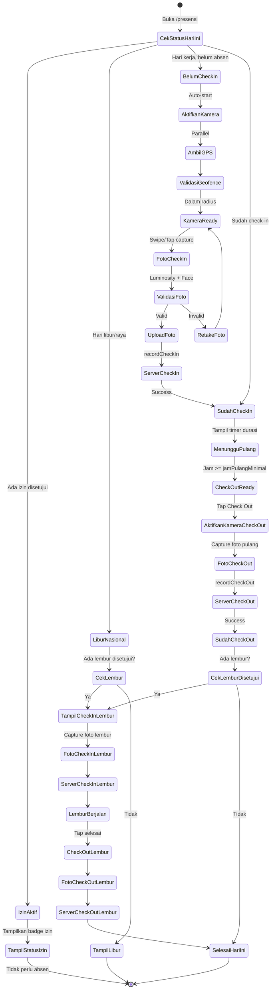

# 🔬 AUDIT MENDALAM & BLUEPRINT REFAKTOR
# Modul Presensi × Izin × Lembur — Unified Attendance Hub

> **Auditor**: Antigravity IDE (Claude Opus 4.6 Thinking)
> **Tanggal**: 24 September 2026
> **Scope**: `/presensi`, `/izin`, `/lembur`, CameraCapture, Anti-Fraud, Server Actions
> **Status**: 📋 RENCANA — Menunggu Persetujuan

---

## Ringkasan Eksekutif

1. ❌ **Menu Presensi terisolasi** — tidak menampilkan status Izin/Lembur hari ini; pegawai bingung apakah hari ini perlu absen atau tidak
2. ❌ **Alur foto (CameraCapture) tidak sinkron** — foto diambil SEBELUM check-in, tapi check-out tidak memerlukan foto baru (reuse foto check-in)
3. ❌ **Lembur check-in/check-out menggunakan foto placeholder** — BUKAN kamera asli (`"/placeholder-foto.jpg"`)
4. ❌ **Tiga menu terpisah** untuk hal yang saling terkait — UX fragmentaris, user harus berpindah-pindah menu
5. ⚠️ **Mobile-first belum optimal** — layout masih menggunakan Card-based desktop pattern, bukan native-app-feel
6. 🎯 **Solusi**: Unified Attendance Hub — satu dashboard yang mengkonsolidasi Presensi + Izin + Lembur dalam satu pengalaman borderless

---

## BAGIAN A: TEMUAN AUDIT MENDALAM

### A1. Masalah Sinkronisasi Presensi ↔ Izin ↔ Lembur

| # | Temuan | Severity | File |
|---|--------|----------|------|
| S-1 | **Presensi tidak cek status Izin aktif** — Pegawai yang sudah disetujui izin/cuti tetap bisa check-in presensi biasa. Seharusnya sistem otomatis menandai status `"izin"` / `"cuti"` / `"sakit"` / `"dinas"` | 🔴 Critical | [presensi.ts:72-191](file:///d:/Project/GAWE/PresensiASN/src/actions/presensi.ts#L72-L191) |
| S-2 | **Presensi tidak cek status Lembur** — Jika hari ini ada lembur yang disetujui, menu presensi tidak menampilkan info apapun tentang sesi lembur | 🔴 Critical | [page.tsx (presensi)](file:///d:/Project/GAWE/PresensiASN/src/app/%28dashboard%29/presensi/page.tsx) |
| S-3 | **Check-out presensi dan check-in lembur tidak terkorelasi** — Seharusnya setelah check-out presensi reguler, ada opsi langsung check-in lembur jika ada pengajuan yang disetujui | 🟠 High | [lembur.ts:251-330](file:///d:/Project/GAWE/PresensiASN/src/actions/lembur.ts#L251-L330) |
| S-4 | **Status presensi `"izin"`, `"sakit"`, `"cuti"`, `"dinas"` tidak pernah diset secara otomatis** — Field ada di `PresensiStatus` tapi tidak ada kode yang mengisinya berdasarkan data izin | 🔴 Critical | [types/index.ts:3-11](file:///d:/Project/GAWE/PresensiASN/src/types/index.ts#L3-L11) |
| S-5 | **Kalender kerja tidak terintegrasi** — Tidak ada pengecekan apakah hari ini libur nasional/hari raya sebelum presensi | 🟡 Medium | — |

### A2. Masalah Alur Foto & Kamera

| # | Temuan | Severity | File |
|---|--------|----------|------|
| F-1 | **Foto hanya diambil 1x untuk check-in** — Check-out tidak memerlukan foto baru, padahal seharusnya ada foto pulang untuk verifikasi kehadiran sampai akhir | 🔴 Critical | [page.tsx:209](file:///d:/Project/GAWE/PresensiASN/src/app/%28dashboard%29/presensi/page.tsx#L209) |
| F-2 | **Foto check-out reuse foto check-in** — Payload check-out mengirim `existingFotoUrl` (foto check-in), bukan foto baru. Ini membuat audit forensik tidak valid | 🔴 Critical | [page.tsx:198-226](file:///d:/Project/GAWE/PresensiASN/src/app/%28dashboard%29/presensi/page.tsx#L198-L226) |
| F-3 | **Lembur check-in/out menggunakan foto PLACEHOLDER** — `const fotoUrl = "/placeholder-foto.jpg"` — ini bukan foto kamera asli! | 🔴 Critical | [lembur/page.tsx:161](file:///d:/Project/GAWE/PresensiASN/src/app/%28dashboard%29/lembur/page.tsx#L161) |
| F-4 | **CameraCapture berhenti setelah 1 foto** — Setelah foto pertama diambil, stream kamera dihentikan (`stopCamera()`). Tidak ada opsi retake atau foto kedua untuk check-out | 🟠 High | [CameraCapture.tsx:191](file:///d:/Project/GAWE/PresensiASN/src/components/presensi/CameraCapture.tsx#L191) |
| F-5 | **Swipe-to-capture mungkin tidak intuitif** — Mekanisme drag knob untuk ambil foto bisa membingungkan user. Sebagian besar aplikasi presensi modern menggunakan tap-to-capture atau auto-capture | 🟡 Medium | [CameraCapture.tsx:232-274](file:///d:/Project/GAWE/PresensiASN/src/components/presensi/CameraCapture.tsx#L232-L274) |
| F-6 | **Face Detection tidak memblokir** — Jika wajah tidak terdeteksi, hanya `console.warn`. Foto tetap bisa dipakai untuk check-in tanpa wajah tervalidasi | 🟠 High | [CameraCapture.tsx:173-176](file:///d:/Project/GAWE/PresensiASN/src/components/presensi/CameraCapture.tsx#L173-L176) |

### A3. Masalah UX / Mobile-First

| # | Temuan | Severity | File |
|---|--------|----------|------|
| U-1 | **Menu presensi, izin, dan lembur terpisah di 3 route berbeda** — User harus navigasi bolak-balik. Tidak ada "satu pandangan" kehadiran hari ini | 🔴 Critical | Sidebar + BottomNav |
| U-2 | **BottomNav menyembunyikan menu Izin** — Menu "Pengajuan Izin & Cuti" (`/izin`) TIDAK ADA di bottom navigation mobile. Hanya muncul di Sidebar desktop | 🔴 Critical | [BottomNav.tsx:29-63](file:///d:/Project/GAWE/PresensiASN/src/components/dashboard/BottomNav.tsx#L29-L63) |
| U-3 | **Lembur/Approval berganti-ganti di BottomNav berdasarkan role** — Pegawai tidak punya akses cepat ke menu Izin | 🟠 High | [BottomNav.tsx:46-57](file:///d:/Project/GAWE/PresensiASN/src/components/dashboard/BottomNav.tsx#L46-L57) |
| U-4 | **Halaman izin menggunakan layout desktop (grid 1:2)** — Pada mobile, form dan riwayat mengstack vertikal dengan jarak terlalu besar | 🟡 Medium | [izin/page.tsx:142](file:///d:/Project/GAWE/PresensiASN/src/app/%28dashboard%29/izin/page.tsx#L142) |
| U-5 | **Tidak ada loading skeleton** — Saat data dimuat, user melihat halaman kosong tanpa feedback visual | 🟡 Medium | Semua page |
| U-6 | **Tidak ada pull-to-refresh** — Pada PWA mobile, user tidak bisa tarik-ke-bawah untuk refresh data | 🟡 Medium | — |
| U-7 | **Tidak ada riwayat presensi di halaman presensi** — Hanya menampilkan status hari ini. User harus ke halaman lain untuk melihat history | 🟠 High | [presensi/page.tsx](file:///d:/Project/GAWE/PresensiASN/src/app/%28dashboard%29/presensi/page.tsx) |
| U-8 | **GPS status tidak real-time** — GPS diambil 1x saat halaman dibuka, tidak ada mekanisme refresh GPS jika user bergerak | 🟡 Medium | [presensi/page.tsx:62-108](file:///d:/Project/GAWE/PresensiASN/src/app/%28dashboard%29/presensi/page.tsx#L62-L108) |

### A4. Masalah Arsitektur & Data

| # | Temuan | Severity | File |
|---|--------|----------|------|
| D-1 | **CheckOutPayload tidak memiliki field `fotoUrl` yang terpisah dari check-in** — Desain type seolah checkout punya foto sendiri, tapi implementasinya reuse foto check-in | 🟠 High | [types/index.ts:213-227](file:///d:/Project/GAWE/PresensiASN/src/types/index.ts#L213-L227) |
| D-2 | **Tidak ada cross-reference antara koleksi `presensi` dan `izin`** — PresensiRecord punya `suratIzinUrl` tapi tidak ada `izinId` untuk linking | 🟠 High | [types/index.ts:108-124](file:///d:/Project/GAWE/PresensiASN/src/types/index.ts#L108-L124) |
| D-3 | **Tidak ada cross-reference antara `presensi` dan `lemburRecords`** — Tidak bisa tahu bahwa presensi hari X ada sesi lembur yang terkait | 🟠 High | — |
| D-4 | **`PengajuanIzinItem.atasanId` bersifat optional** — Seharusnya wajib (required) agar bisa difilter per atasan | 🟠 High | [types/index.ts:182](file:///d:/Project/GAWE/PresensiASN/src/types/index.ts#L182) |
| D-5 | **Izin submission tidak menyertakan `atasanId`** — Form di `/izin` tidak mengirim `atasanId` ke server action `submitIzin()` | 🔴 Critical | [izin/page.tsx:87-99](file:///d:/Project/GAWE/PresensiASN/src/app/%28dashboard%29/izin/page.tsx#L87-L99) |

---

## BAGIAN B: BLUEPRINT REFAKTOR — "UNIFIED ATTENDANCE HUB"

### B1. Visi Desain

```
┌─────────────────────────────────────────────────────────────┐
│                 UNIFIED ATTENDANCE HUB                       │
│                                                             │
│  "Satu halaman untuk semua kehadiran —                      │
│   check-in, check-out, izin, lembur, riwayat"              │
│                                                             │
│  Prinsip:                                                   │
│  ✦ Mobile-First Borderless (tanpa card nesting berlebih)    │
│  ✦ Satu Pandangan (Single View) status kehadiran hari ini   │
│  ✦ Context-Aware (adaptif berdasarkan situasi pegawai)      │
│  ✦ Progressive Disclosure (info detail muncul saat relevan) │
│  ✦ Kamera-Sentris (foto = aksi utama, bukan form)           │
└─────────────────────────────────────────────────────────────┘
```

### B2. Arsitektur Route Baru

```
SEBELUM (3 menu terpisah):              SESUDAH (1 Hub + 2 sub-page):
├── /presensi     (Check-in/out)        ├── /presensi              (Unified Hub)
├── /izin         (Form izin)           │   ├── Tab: Absensi       (Check-in/out utama)
├── /lembur       (Form + check-in/out) │   ├── Tab: Izin & Cuti   (Quick-form izin)
                                        │   ├── Tab: Lembur        (Pengajuan + check-in/out)
                                        │   └── Tab: Riwayat       (Timeline 30 hari)
                                        │
                                        ├── /izin        → Redirect ke /presensi?tab=izin
                                        └── /lembur      → Redirect ke /presensi?tab=lembur
```

### B3. Wireframe Mobile (ASCII)

```
╔═══════════════════════════════════════╗
║  ← Presensi Dinas              🟢 GPS ║
║  Kamis, 24 Sep 2026                   ║
╠═══════════════════════════════════════╣
║                                       ║
║  ┌─────────────────────────────────┐  ║
║  │                                 │  ║
║  │      📸 LIVE CAMERA FEED       │  ║
║  │                                 │  ║
║  │   ┌───────────────────────┐     │  ║
║  │   │  Face Guide Oval 👤  │     │  ║
║  │   │                       │     │  ║
║  │   └───────────────────────┘     │  ║
║  │                                 │  ║
║  │  📍 BKPSDM Surakarta • 45m     │  ║
║  │  🕐 07:23 WIB                   │  ║
║  └─────────────────────────────────┘  ║
║                                       ║
║  ╭─────────────────────────────────╮  ║
║  │  >>> SWIPE UNTUK CHECK IN >>>  │  ║
║  ╰─────────────────────────────────╯  ║
║                                       ║
║ ┌──────┐┌──────┐┌──────┐┌──────┐     ║
║ │Absen ││Izin  ││Lembur││Riway.│     ║
║ │  ●   ││      ││      ││      │     ║
║ └──────┘└──────┘└──────┘└──────┘     ║
║                                       ║
║  ─── Timeline Hari Ini ───           ║
║  ✅ 07:23 Check-In BKPSDM            ║
║  ⏳ --:-- Menunggu Check-Out         ║
║  🟣 16:30 Lembur Disetujui           ║
║                                       ║
╚═══════════════════════════════════════╝
```

### B4. State Machine — Alur Presensi Terintegrasi



### B5. Rencana Refaktor — Fase Per Fase

---

#### FASE 1: Sinkronisasi Data (Backend First) — Est. 2-3 hari

> **Tujuan**: Fix semua masalah data flow dan sinkronisasi sebelum sentuh UI

**Task 1.1 — Cross-check Izin pada Check-In**
- File: [presensi.ts](file:///d:/Project/GAWE/PresensiASN/src/actions/presensi.ts)
- Aksi: Di `recordCheckIn()`, tambahkan pengecekan apakah user punya izin yang disetujui untuk `tanggal` tersebut
- Jika ada izin aktif: tolak check-in, kembalikan pesan + data izin
- Tambahkan server action baru: `getKehadiranStatusHariIni(userId, tanggal)` yang menggabungkan data presensi, izin, dan lembur

```typescript
// NEW: Unified daily attendance status
export async function getKehadiranStatusHariIni(
  userId: string,
  tanggal: string
): Promise<{
  presensi: PresensiRecord | null;
  izinAktif: PengajuanIzinItem | null;
  lemburAktif: LemburRecord | null;
  isHariLibur: boolean;
  statusKehadiran: 'belum_absen' | 'hadir' | 'izin' | 'cuti' | 'sakit' | 'dinas' | 'lembur' | 'libur';
}>
```

**Task 1.2 — Auto-set PresensiStatus dari Izin**
- File: [presensi.ts](file:///d:/Project/GAWE/PresensiASN/src/actions/presensi.ts)
- Aksi: Buat cron/trigger yang otomatis membuat record presensi dengan status `"izin"` / `"cuti"` / `"sakit"` / `"dinas"` untuk tanggal-tanggal yang tercakup izin yang disetujui
- Atau: Saat `approveIzin()` dipanggil, auto-generate presensi records untuk tanggal mulai-selesai

**Task 1.3 — Link Presensi ↔ Lembur**
- File: [types/index.ts](file:///d:/Project/GAWE/PresensiASN/src/types/index.ts)
- Aksi: Tambahkan field `lemburRecordId?: string` di `PresensiRecord` dan `presensiRecordId?: string` di `LemburRecord`

**Task 1.4 — Fix `atasanId` pada Izin**
- File: [izin.ts](file:///d:/Project/GAWE/PresensiASN/src/actions/izin.ts), [izin/page.tsx](file:///d:/Project/GAWE/PresensiASN/src/app/%28dashboard%29/izin/page.tsx)
- Aksi: Jadikan `atasanId` required di `PengajuanIzinItem`, dan sertakan dari `user.atasanId` saat submit

**Task 1.5 — Foto Check-Out Wajib Terpisah**
- File: [presensi.ts](file:///d:/Project/GAWE/PresensiASN/src/actions/presensi.ts)
- Aksi: Validasi bahwa `fotoUrl` pada check-out berbeda dari `fotoUrl` check-in
- Tambahkan field `checkOutFotoUrl` yang terpisah

---

#### FASE 2: Refaktor CameraCapture (Kamera Fleksibel) — Est. 2-3 hari

> **Tujuan**: Kamera yang bisa dipakai berulang (check-in, check-out, lembur) dengan UX yang lebih intuitif

**Task 2.1 — CameraCapture Multi-Mode**
- File: [CameraCapture.tsx](file:///d:/Project/GAWE/PresensiASN/src/components/presensi/CameraCapture.tsx)
- Aksi: Refaktor menjadi stateless/reusable dengan props:
  ```typescript
  interface CameraCaptureProps {
    mode: 'check-in' | 'check-out' | 'lembur-in' | 'lembur-out';
    onCapture: (fotoUrl: string, sizeBytes: number) => void;
    onRetake: () => void;         // NEW: Opsi retake
    allowRetake?: boolean;         // Default true
    requireFace?: boolean;         // Default true — blokir jika tidak ada wajah
    // ... metadata props
  }
  ```

**Task 2.2 — Face Guide Oval Overlay**
- Aksi: Tambahkan oval overlay semi-transparan di tengah viewfinder sebagai panduan posisi wajah
- Referensi: UI e-KTP, GoPay, Gojek verification

**Task 2.3 — Auto-Capture dengan Countdown**
- Aksi: Setelah wajah terdeteksi & stabil 2 detik → auto-capture dengan countdown 3-2-1
- Fallback: Tetap bisa tap manual jika auto-capture gagal

**Task 2.4 — Face Detection yang Memblokir**
- File: [CameraCapture.tsx:173-176](file:///d:/Project/GAWE/PresensiASN/src/components/presensi/CameraCapture.tsx#L173-L176)
- Aksi: Jika `requireFace = true` dan browser mendukung FaceDetector, BLOKIR capture jika tidak ada wajah
- Pada browser yang tidak mendukung: skip validasi (graceful degradation)

**Task 2.5 — Hapus Foto Placeholder di Lembur**
- File: [lembur/page.tsx:161](file:///d:/Project/GAWE/PresensiASN/src/app/%28dashboard%29/lembur/page.tsx#L161)
- Aksi: Integrasikan CameraCapture asli ke flow lembur check-in/check-out

---

#### FASE 3: Unified Attendance Hub UI — Est. 4-5 hari

> **Tujuan**: Satu halaman borderless yang menggabungkan Presensi + Izin + Lembur

**Task 3.1 — Redesign `/presensi` sebagai Hub Tabbed**
- File: [presensi/page.tsx](file:///d:/Project/GAWE/PresensiASN/src/app/%28dashboard%29/presensi/page.tsx)
- Aksi: Redesign total menjadi 4-tab layout:

```
Tab 1: "Absensi"   — Check-in/out utama (kamera hero)
Tab 2: "Izin"      — Quick-form izin/cuti + riwayat
Tab 3: "Lembur"    — Pengajuan + presensi lembur
Tab 4: "Riwayat"   — Timeline 30 hari (semua jenis kehadiran)
```

**Task 3.2 — Context-Aware Hero Card**
- Aksi: Hero section berubah otomatis berdasarkan status hari ini:

| Status | Hero UI |
|--------|---------|
| Belum check-in | 📸 Live camera + swipe check-in |
| Sudah check-in, belum check-out | ⏱️ Timer durasi kerja + tombol check-out |
| Sudah check-out | ✅ Ringkasan hari ini + durasi |
| Ada izin disetujui | 📋 Badge izin aktif + detail izin |
| Hari libur | 🏖️ Info hari libur |
| Lembur disetujui (pasca check-out) | 🟣 Panel check-in lembur |
| Lembur berjalan | ⏱️ Timer lembur + check-out |

**Task 3.3 — Borderless Mobile Design**
- Aksi: Implementasi desain borderless:
  - Hapus Card wrapping yang berlebihan
  - Full-width sections dengan divider halus
  - Kamera mengambil 60% layar atas (immersive)
  - Gradient backdrop yang seamless
  - Bottom sheet untuk form izin (bukan halaman baru)
  - Sticky tab bar dengan smooth scroll

**Task 3.4 — Timeline Riwayat Terintegrasi**
- Aksi: Tab "Riwayat" menampilkan gabungan dari:
  - Record presensi (check-in/out)
  - Record izin (dengan badge status)
  - Record lembur (dengan durasi)
  - Hari libur (dari kalender kerja)
- Semua dalam satu timeline visual per tanggal

**Task 3.5 — Quick-Form Izin (Bottom Sheet)**
- Aksi: Form pengajuan izin sebagai bottom sheet yang bisa ditarik dari tab "Izin", bukan halaman terpisah
- Auto-fill `atasanId` dari `user.atasanId`
- Preview jumlah hari otomatis saat tanggal berubah

**Task 3.6 — Redirect Legacy Routes**
- File: `/izin/page.tsx`, `/lembur/page.tsx`
- Aksi: Redirect ke `/presensi?tab=izin` dan `/presensi?tab=lembur`
- Preservasi backward-compatibility

---

#### FASE 4: Real-Time & Polish — Est. 2-3 hari

**Task 4.1 — GPS Real-Time Tracking**
- Aksi: Gunakan `navigator.geolocation.watchPosition()` sebagai pengganti `getCurrentPosition()` satu kali
- Tampilkan jarak real-time ke kantor yang berubah saat user bergerak
- Auto-refresh badge "45m" → "32m" → "✓ Dalam Radius"

**Task 4.2 — Skeleton Loading States**
- Aksi: Buat skeleton loader khusus untuk setiap state:
  - Camera skeleton (rounded rectangle gelap)
  - Timeline skeleton (3 baris animasi)
  - Form skeleton

**Task 4.3 — Haptic Feedback & Sound**
- Aksi: Tambahkan feedback sensorik:
  - Vibrate saat check-in/out berhasil
  - Vibrate pattern berbeda untuk error
  - Sound chime sudah ada — pastikan konsisten

**Task 4.4 — Pull-to-Refresh**
- Aksi: Implementasi pull-to-refresh untuk invalidate TanStack Query cache
- Animasi refresh indicator native-feel

**Task 4.5 — Offline Queue**
- Aksi: Jika jaringan terputus saat check-in:
  - Simpan payload ke IndexedDB
  - Auto-retry saat online kembali
  - Badge indicator "Menunggu Sinkronisasi"

---

#### FASE 5: Navigasi & Integrasi Ecosystem — Est. 1-2 hari

**Task 5.1 — Update BottomNav**
- File: [BottomNav.tsx](file:///d:/Project/GAWE/PresensiASN/src/components/dashboard/BottomNav.tsx)
- Aksi: Tambahkan badge dinamis di ikon Presensi yang menunjukkan status hari ini:
  - 🔴 Belum absen
  - 🟢 Sudah check-in
  - ✅ Lengkap (check-in + check-out)
  - 📋 Izin aktif

**Task 5.2 — Update Sidebar**
- File: [Sidebar.tsx](file:///d:/Project/GAWE/PresensiASN/src/components/dashboard/Sidebar.tsx)
- Aksi: Konsolidasi menu:
  - "Presensi Harian" → "Kehadiran" (Hub utama)
  - "Pengajuan Izin & Cuti" → Sub-item atau remove (masuk ke Hub)
  - "Lembur Pegawai" → Sub-item atau remove (masuk ke Hub)

**Task 5.3 — Dashboard Widget**
- Aksi: Dashboard utama (`/`) menampilkan widget ringkasan kehadiran hari ini yang link ke Hub

---

### B6. Perbandingan UX: Sebelum vs Sesudah

| Aspek | Sebelum (Sekarang) | Sesudah (Refaktor) |
|-------|--------------------|--------------------|
| **Menu navigasi** | 3 menu terpisah (Presensi, Izin, Lembur) | 1 Hub dengan 4 tab |
| **Mobile access izin** | ❌ Tidak ada di BottomNav | ✅ Tab di dalam Hub |
| **Foto check-out** | Reuse foto check-in | Foto baru wajib |
| **Foto lembur** | Placeholder fake | Kamera asli |
| **Face detection** | Non-blocking (warning only) | Blocking jika supported |
| **GPS tracking** | Satu kali saat load | Real-time watchPosition |
| **Status izin di presensi** | ❌ Tidak saling tahu | ✅ Auto-block & display |
| **Status lembur di presensi** | ❌ Terpisah total | ✅ Post-checkout panel |
| **Riwayat kehadiran** | Tidak ada di /presensi | Tab riwayat 30 hari |
| **Camera UX** | Swipe drag knob | Face guide + auto-capture + tap |
| **Loading states** | Kosong/blank | Skeleton animation |
| **Offline support** | ❌ Crash | Queue + retry |

---

### B7. File yang Terdampak Perubahan

```
Modifikasi:
├── src/actions/presensi.ts              ← +getKehadiranStatusHariIni, cross-check izin
├── src/actions/izin.ts                  ← +atasanId required, auto-generate presensi
├── src/actions/lembur.ts                ← Link ke presensiRecordId
├── src/types/index.ts                   ← +field baru, atasanId required
├── src/hooks/usePresensi.ts             ← +useKehadiranStatus hook
├── src/components/presensi/CameraCapture.tsx ← Multi-mode, face guide, retake
├── src/components/dashboard/BottomNav.tsx    ← Badge status, menu restructure
├── src/components/dashboard/Sidebar.tsx      ← Menu consolidation

Rewrite:
├── src/app/(dashboard)/presensi/page.tsx ← Total redesign (Unified Hub)

Redirect/Deprecate:
├── src/app/(dashboard)/izin/page.tsx     ← Redirect ke /presensi?tab=izin
├── src/app/(dashboard)/lembur/page.tsx   ← Redirect ke /presensi?tab=lembur

File Baru:
├── src/components/presensi/AttendanceHub.tsx      ← Orchestrator component
├── src/components/presensi/TabAbsensi.tsx          ← Tab check-in/out
├── src/components/presensi/TabIzin.tsx             ← Tab izin quick-form
├── src/components/presensi/TabLembur.tsx           ← Tab lembur
├── src/components/presensi/TabRiwayat.tsx          ← Tab timeline
├── src/components/presensi/ContextHeroCard.tsx     ← Adaptive hero section
├── src/components/presensi/FaceGuideOverlay.tsx    ← Oval face guide
├── src/components/presensi/DurationTimer.tsx       ← Live timer widget
├── src/components/presensi/IzinBottomSheet.tsx     ← Bottom sheet form izin
├── src/hooks/useKehadiranStatus.ts                ← Unified attendance hook
├── src/hooks/useGpsTracker.ts                     ← Real-time GPS hook
├── src/lib/offline-queue.ts                       ← IndexedDB queue
```

---

### B8. Estimasi Waktu Total

| Fase | Deskripsi | Durasi |
|------|-----------|--------|
| Fase 1 | Sinkronisasi Data (Backend) | 2-3 hari |
| Fase 2 | Refaktor CameraCapture | 2-3 hari |
| Fase 3 | Unified Attendance Hub UI | 4-5 hari |
| Fase 4 | Real-Time & Polish | 2-3 hari |
| Fase 5 | Navigasi & Integrasi | 1-2 hari |
| **Total** | | **11-16 hari kerja** |

---

### B9. Prioritas Eksekusi (Jika Waktu Terbatas)

Jika hanya punya **5 hari**, fokus pada:

1. ⭐ **Task 1.1** — `getKehadiranStatusHariIni()` (fondasi sinkronisasi)
2. ⭐ **Task 1.4** — Fix `atasanId` pada Izin
3. ⭐ **Task 2.5** — Hapus foto placeholder lembur → gunakan CameraCapture asli
4. ⭐ **Task 3.1 + 3.2** — Redesign presensi page sebagai Hub + Context Hero
5. ⭐ **Task F-1/F-2** — Foto check-out terpisah dari check-in

---

> **⏭️ NEXT STEP**: Setelah rencana ini disetujui, saya akan mulai implementasi dari **Fase 1** (Backend sinkronisasi) karena ini adalah fondasi yang harus benar sebelum UI diubah.

---

*Dokumen ini dibuat oleh Antigravity IDE berdasarkan audit mendalam terhadap 15+ file sumber, mencakup server actions, hooks, page components, anti-fraud modules, dan type definitions.*
